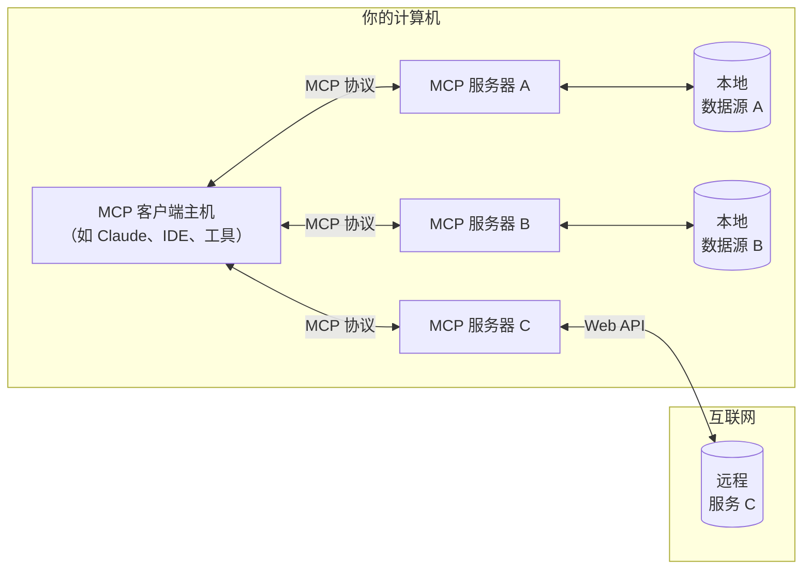

# 简介

开始使用 Model Context Protocol（MCP）

MCP 是一种开放协议，用于标准化应用程序向大语言模型（LLM）提供上下文的方式。你可以将 MCP 想象成 AI 应用程序中的 USB-C 接口。正如 USB-C 提供了一种标准化方式来连接各种外设和配件，MCP 则提供了一种标准化方式，将 AI 模型连接到不同的数据源和工具。

## 为什么选择 MCP？

MCP 可帮助你基于 LLM 构建智能代理和复杂的工作流程。由于 LLM 经常需要集成数据和工具，MCP 提供了：

- 越来越多的预构建集成，LLM 可直接接入
- 在不同 LLM 提供商和厂商之间灵活切换的能力
- 在本地基础设施中保障数据安全的最佳实践

### 总体架构

MCP 基于客户端-服务器架构，主机应用可以连接多个服务器：

- **MCP 主机**：如 Claude 桌面版、集成开发环境（IDE）或其他 AI 工具，需通过 MCP 访问数据
- **MCP 客户端**：维护与服务器 1:1 连接的协议客户端
- **MCP 服务器**：通过标准化的 Model Context Protocol 暴露特定能力的轻量级程序
- **本地数据源**：MCP 服务器可安全访问的计算机文件、数据库与服务
- **远程服务**：通过互联网可访问的外部系统（如 API）

