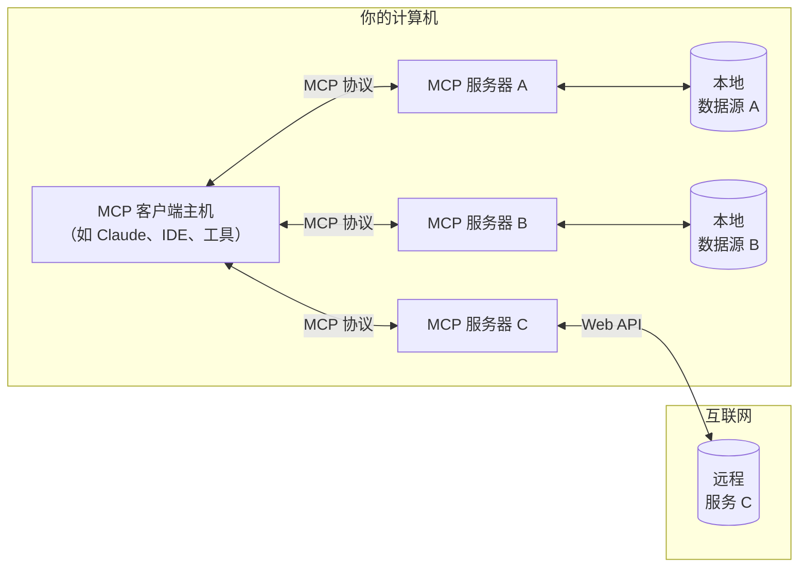

# 简介

开始使用 Model Context Protocol（MCP）

MCP 是一种开放协议，用于标准化应用程序向大语言模型（LLM）提供上下文的方式。你可以将 MCP 想象成 AI 应用程序中的 USB-C 接口。正如 USB-C 提供了一种标准化方式来连接各种外设和配件，MCP 则提供了一种标准化方式，将 AI 模型连接到不同的数据源和工具。

## 为什么选择 MCP？

MCP 可帮助你基于 LLM 构建智能代理和复杂的工作流程。由于 LLM 经常需要集成数据和工具，MCP 提供了：

- 越来越多的预构建集成，LLM 可直接接入
- 在不同 LLM 提供商和厂商之间灵活切换的能力
- 在本地基础设施中保障数据安全的最佳实践

### 总体架构

MCP 基于客户端-服务器架构，主机应用可以连接多个服务器：

- **MCP 主机**：如 Claude 桌面版、集成开发环境（IDE）或其他 AI 工具，需通过 MCP 访问数据
- **MCP 客户端**：维护与服务器 1:1 连接的协议客户端
- **MCP 服务器**：通过标准化的 Model Context Protocol 暴露特定能力的轻量级程序
- **本地数据源**：MCP 服务器可安全访问的计算机文件、数据库与服务
- **远程服务**：通过互联网可访问的外部系统（如 API）

## 开始使用

请选择最适合你的路径：

#### 快速开始

<CardGroup cols={2}> <Card title="面向服务器开发者" icon="bolt" href="/quickstart/server"> 开始构建你自己的服务器，可供 Claude 桌面版和其他客户端使用 </Card> <Card title="面向客户端开发者" icon="bolt" href="/quickstart/client"> 开始构建你自己的客户端，可兼容所有 MCP 服务器 </Card> <Card title="面向 Claude 桌面用户" icon="bolt" href="/quickstart/user"> 开始在 Claude 桌面版中使用预构建服务器 </Card> </CardGroup>

#### 示例

## 教程

## 深入了解 MCP

深入探索 MCP 的核心概念与功能：

## 参与贡献

想参与贡献？请查看我们的[贡献指南](https://chatgpt.com/development/contributing)，了解如何改进 MCP。

## 支持与反馈

获取帮助或提供反馈的方式如下：

- 若你在 MCP 规范、SDK 或文档（开源）方面有 Bug 报告或功能请求，请[提交 GitHub issue](https://github.com/modelcontextprotocol)
- 若想就 MCP 规范进行讨论或提问，请访问 [规范讨论区](https://github.com/modelcontextprotocol/specification/discussions)
- 若要讨论其他 MCP 开源组件，请访问 [组织讨论区](https://github.com/orgs/modelcontextprotocol/discussions)
- 若你在 Claude.app 和 claude.ai 的 MCP 集成方面有 Bug 报告、功能请求或问题，请参阅 Anthropic 的[支持指南](https://support.anthropic.com/en/articles/9015913-how-to-get-support)

------

如需继续翻译更多文档或有格式/术语上的特别需求，请随时告诉我。